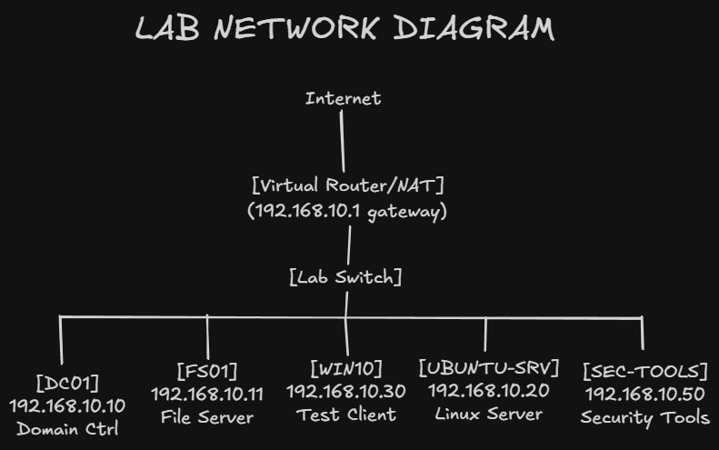

# Enterprise Network Security Lab

A virtual lab, emulating a small Windows + Linux enterprise with the Active Directory, file services, Ubuntu server and a Kali security tools VM to perform vulnerability evaluation and monitoring.

## Goals

- Learn to design a segmented enterprise-style network using static IP address.
- Build and manage Active Directory, DNS and domain-joined clients.
- Scan the vulnerability and harden the vulnerability using Kali and Ubuntu.
- Develop document architecture, configuration and troubleshooting in a manner that is representative of actual enterprise practice.

## Lab Components

All virtual machines run on VMware Workstation using a custom host‑only network (VMnet1) for the 192.168.10.0/24 lab LAN.

- **DC01** – Windows Server 2022; Active Directory Domain Services and DNS.  
  - IP: `192.168.10.10` (gateway `192.168.10.1`, DNS points to itself)  
- **FS01** – Windows Server 2022; file server for domain users.  
  - IP: `192.168.10.11`  
- **WIN10** – Windows 10; domain‑joined workstation.  
  - IP: `192.168.10.30`  
- **UBUNTU-SRV** – Ubuntu Server; Linux services and scan target.  
  - IP: `192.168.10.20`  
- **SEC-TOOLS** – Kali Linux; security tools and attacker box.  
  - IP: `192.168.10.50` (on the same 192.168.10.0/24 lab network)  

The lab network is documented and diagrammed in `docs/02-network-design.md` and `diagrams/lab-network.png`:



## Architecture and Design Highlights

- Single lab subnet `192.168.10.0/24` with reserved ranges:  
  - `.1` – virtual router / VMware NAT  
  - `.10–.19` – core infrastructure (DC01, FS01, UBUNTU-SRV)  
  - `.20–.99` – additional servers and tools  
  - `.100–.200` – clients and test systems  
- Only one NIC is running on VMnet1, any additional adapters (such as 192.168.159.x and 192.168.61.x networks) are disabled not to confuse routing.
- DC01 offers ADDS and DNS to the corp.local domain; the default DNS server of all windows hosts is 192.168.10.10.
- Targeted ping tests and troubleshooting are done to verify network connectivity including enabling ICMP Echo (ping) where necessary.

## Connectivity and ICMP Echo Troubleshooting

Windows server usually blocks the ICMP echo requests by default. That behavior was the initial cause of the failures of ping between WIN10 and FS01, although there were no problems with IP addressing and DNS.

To fix this while keeping the firewall enabled:

1. Verified addressing on WIN10 and FS01 using `ipconfig`  
   (see `screenshots/ipconfig-win10.png` and `screenshots/failed-ping-win10-to-fs01.png`).  
2. Confirmed both VMs were on VMnet1 and could reach the default gateway `192.168.10.1`.  
3. Enabled the built‑in Windows Defender Firewall rules for ICMP Echo on the servers:

```powershell
Enable-NetFirewallRule -DisplayGroup "File and Printer Sharing"
```
This enables the **Echo Request – ICMPv4-In** rules and allows internal ping to be used for troubleshooting and monitoring. The change and results are documented in:

- 
- 

Further validation between Kali and Ubuntu is shown in:

- 

## Documentation

The lab is recorded in greater detail in the `docs/` folder:

- [Lab Overview](docs/01-lab-overview.md)  
  - Purpose, scenario, VM inventory table, and host platform.  

- [Network Design](docs/02-network-design.md)  
  - Network diagram reference, adapter design, IP plan, and reserved ranges.  

- [Build Notes – Phase 1 Setup](docs/03-build-notes-phase1.md)  
  - Static IP assignments, DC01 promotion, joining FS01 and WIN10 to `corp.local`, and key troubleshooting steps (including ICMP Echo configuration).  

These reports, diagrams, and screenshots show both the design choices and the implementation work behind the lab.


