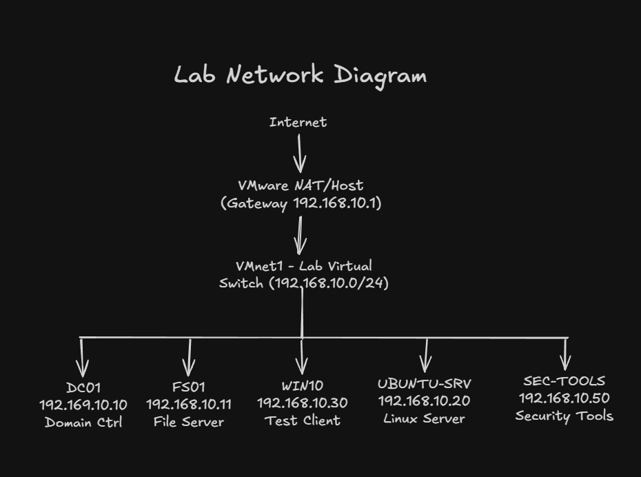

# Network Design

This document describes the IP addressing plan, adapter design, and a high‑level diagram of the lab network.

## IP Addressing Plan

- Network: 192.168.10.0/24  
- Subnet mask: 255.255.255.0  
- Default gateway: 192.168.10.1 (VMware NAT / host gateway)  
- DNS server: 192.168.10.10 (DC01)

### Reserved Ranges

- 192.168.10.1 – Gateway (VMware NAT / host)  
- 192.168.10.10–192.168.10.19 – Core infrastructure (DC01, file server, Ubuntu services)  
- 192.168.10.20–192.168.10.99 – Additional servers and tools (e.g., SEC‑TOOLS)  
- 192.168.10.100–192.168.10.200 – Clients and test systems (e.g., WIN10)

The lab uses a single /24 network, which is typical for small homelab or small office environments and leaves room for growth.

## Adapter Design

Each virtual machine in the lab is connected to a single lab LAN network to keep routing simple and predictable.

- Each VM has **one active NIC** attached to the same VMware VMnet that represents the 192.168.10.0/24 lab LAN.  
- Any extra NICs that picked up addresses on other networks (for example, 192.168.159.0/24 or 192.168.61.0/24) are disabled to avoid routing confusion and overlapping paths.

Initially, some VMs obtained DHCP addresses on 192.168.159.0/24 and 192.168.61.0/24. I disabled those interfaces and standardized all lab traffic on a single 192.168.10.0/24 VMnet to simplify routing and match a small office LAN.

## Network Diagram

The lab network is a flat Layer‑2 network on a single VMware virtual switch, with Internet access provided by the VMware NAT/host gateway.

- The **VMware NAT / host** component provides the default gateway at 192.168.10.1 and outbound Internet access for all lab systems.  
- A single **VMware VMnet virtual switch** connects core infrastructure (DC01, FS01, UBUNTU‑SRV), the SEC‑TOOLS (Kali) VM, and the WIN10 client on the 192.168.10.0/24 lab LAN.

The diagram is stored as an image in the `diagrams` folder:

