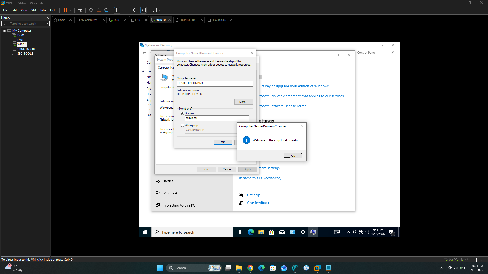
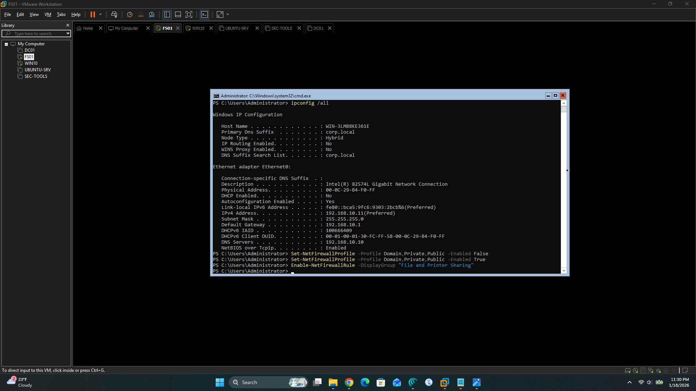

# Build Notes – Phase 1 Setup

This document captures the core configuration steps for bringing the Enterprise Network Security Lab online: static IPs, domain controller promotion, domain joins, and initial connectivity troubleshooting.

## Section A – Static IP Configuration

All VMs are placed on VMware Workstation **VMnet1** and statically addressed in the 192.168.10.0/24 subnet.

### DC01 – Static IP

- Adapter: Ethernet
- IP: 192.168.10.10
- Subnet mask: 255.255.255.0
- Default gateway: 192.168.10.1
- DNS: 192.168.10.10 (self)

Configured via the Ethernet adapter IPv4 properties. DC01 is the anchor for DNS and Active Directory in the `corp.local` domain.

### FS01 – Static IP

- Adapter: Ethernet
- IP: 192.168.10.11
- Subnet mask: 255.255.255.0
- Default gateway: 192.168.10.1
- DNS: 192.168.10.10

Configured through the IPv4 properties after connecting FS01 to VMnet1.

### WIN10 – Static IP

- Adapter: Ethernet0
- IP: 192.168.10.30
- Subnet mask: 255.255.255.0
- Default gateway: 192.168.10.1
- DNS: 192.168.10.10

Set via Control Panel → Network and Sharing Center → Change adapter settings → IPv4 properties. The final configuration is shown in:

### UBUNTU-SRV – Static IP

- Interface: `ens33`  
- Address: `192.168.10.20/24`  
- Gateway: `192.168.10.1`  
- DNS: `8.8.8.8` during install, later updated to `192.168.10.10`  

Configured during Ubuntu Server installation using manual IPv4 settings. The login banner confirms the IP address:


### SEC-TOOLS (Kali) – Static / DHCP on Lab Network

- Interface: `eth0` / `eth1` (depending on VM configuration)  
- Address: `192.168.10.50` (or DHCP from the `192.168.10.0/24` lab network)  
- Gateway: `192.168.10.1`  
- DNS: `192.168.10.10`  

Initially, SEC-TOOLS received an address on a different VMware network (`192.168.159.0/24`), which caused 100% packet loss when pinging `192.168.10.20`. After moving the adapter to VMnet1 and standardizing on `192.168.10.0/24`, ping tests to UBUNTU-SRV succeeded:


---

## Section B – DC01 Domain Controller Promotion

DC01 is promoted to the first domain controller in a new `corp.local` forest using PowerShell.

### 1. Configure IP and DNS on DC01

```powershell
New-NetIPAddress -InterfaceAlias "Ethernet" `
  -IPAddress 192.168.10.10 `
  -PrefixLength 24 `
  -DefaultGateway 192.168.10.1

Set-DnsClientServerAddress -InterfaceAlias "Ethernet" `
  -ServerAddresses 192.168.10.10
```
### 2. Install AD DS Role

```powershell
Install-WindowsFeature AD-Domain-Services -IncludeManagementTools
```
### 3. Create the corp.local Forest
```powershell
Import-Module ADDSDeployment

Install-ADDSForest `
  -DomainName "corp.local" `
  -DomainNetbiosName "CORP" `
  -SafeModeAdministratorPassword (Read-Host -AsSecureString "Enter DSRM password") `
  -InstallDNS `
  -Force
```
This sequence promotes DC01 to the first domain controller in the new corp.local forest and installs integrated DNS to serve the lab domain.

## Section C – Joining FS01 and WIN10 to the Domain

Both FS01 and WIN10 are joined to `corp.local` after their DNS is pointed at DC01.

### 1. Ensure DNS Points to DC01

On each Windows machine, the preferred DNS server is set to `192.168.10.10`. This allows the hosts to locate the domain controller and join the domain.

### 2. Join via PowerShell

On FS01 and WIN10 (run in an elevated PowerShell session):

```powershell
Add-Computer -DomainName "corp.local" -Credential "CORP\Administrator" -Restart
```
After reboot, each system can log on with domain credentials. The Windows 10 domain join is captured here: 


## Section D – Connectivity and ICMP Echo Troubleshooting

Initial ping tests from WIN10 to FS01 failed despite correct addressing and DNS. This was caused by Windows Defender Firewall blocking ICMP echo requests on FS01.

### 1. Baseline Tests

- From WIN10: `ping 192.168.10.10` (DC01) – successful.  
- From WIN10: `ping 192.168.10.11` (FS01) – timed out (documented in `../screenshots/failed-ping-win10-to-fs01.png`).  

### 2. Enabling ICMP Echo on FS01

To align with typical internal monitoring practices and allow ping inside the lab, the built‑in firewall rules for ICMP were enabled:

```powershell
Enable-NetFirewallRule -DisplayGroup "File and Printer Sharing"
```
This activates the Echo Request – ICMPv4‑In rules for all profiles. The change is documented in:
 

### 3. Verification

After enabling the rule:
- From WIN10: ping 192.168.10.11 – replies received (see ../screenshots/build-notes-phase1-screenshots/ping-win10-to-fs01.png).
- Additional tests from SEC-TOOLS and UBUNTU-SRV confirm end‑to‑end connectivity across the lab subnet.

These steps complete Phase 1 of the build: a functioning corp.local domain with Windows and Linux hosts, consistent static addressing, and verified connectivity suitable for future security and hardening work.
