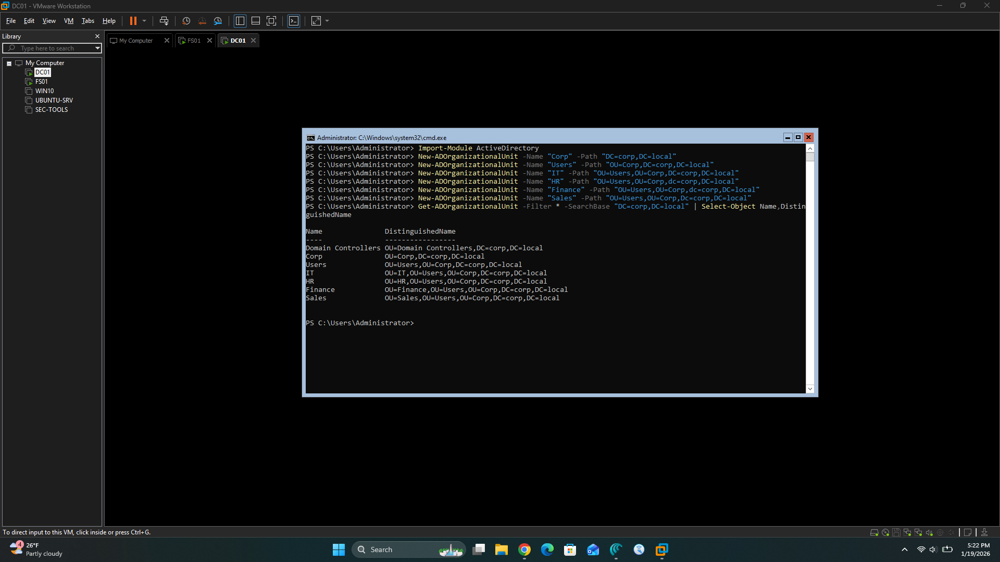
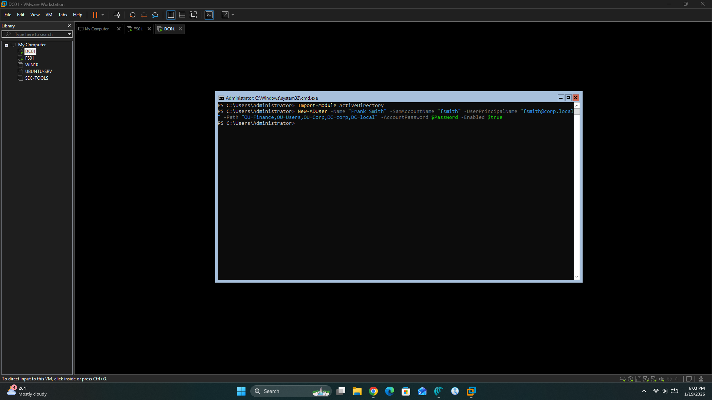
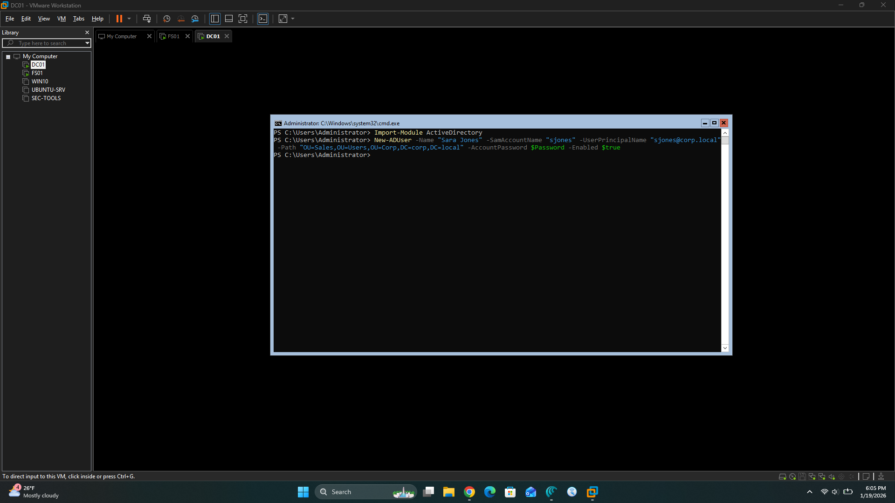
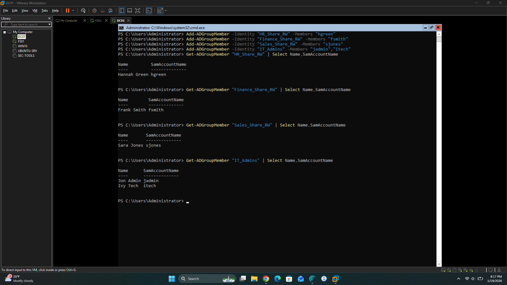
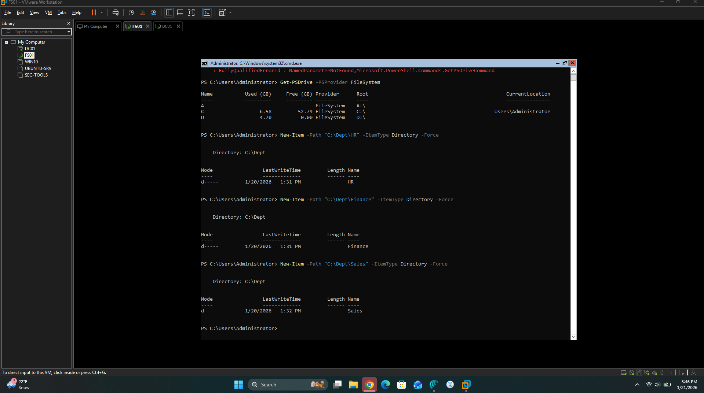
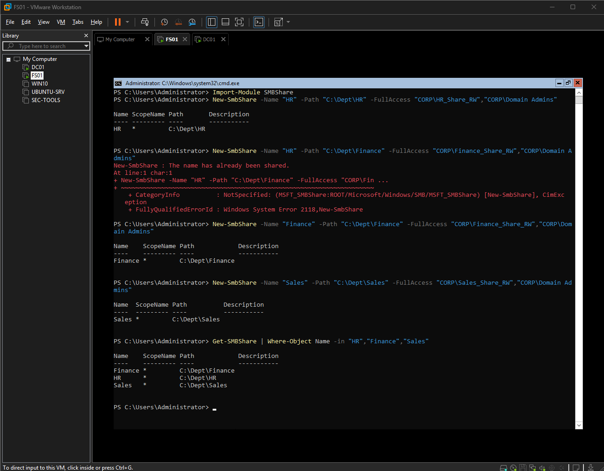
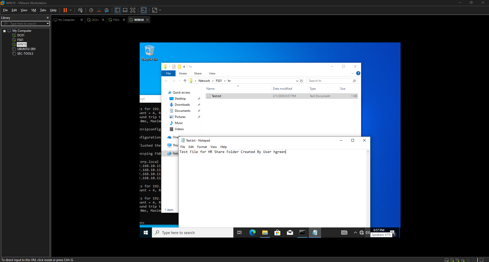
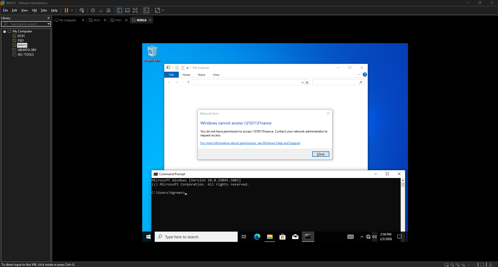

# Build Notes – Phase 2 Virtual Network Architecture

This document records the work completed after Phase 1 to shape the Enterprise Network Security Lab into a realistic small‑enterprise environment: organizing Active Directory, creating users and groups, building the file‑server shares, and preparing the environment for security monitoring and future RMF phases.

---

## Section A – Active Directory Structure and Accounts

### A.1 Create the Corp OU tree

All directory work was done on **DC01** using an elevated PowerShell session and the ActiveDirectory module.

**Goal:** Separate servers, workstations, and users into clear containers that match a real organization.

```powershell
Import-Module ActiveDirectory

# Root business OU
New-ADOrganizationalUnit -Name "Corp" -Path "DC=corp,DC=local"

# Core OUs
New-ADOrganizationalUnit -Name "Servers"      -Path "OU=Corp,DC=corp,DC=local"
New-ADOrganizationalUnit -Name "Workstations" -Path "OU=Corp,DC=corp,DC=local"
New-ADOrganizationalUnit -Name "Users"        -Path "OU=Corp,DC=corp,DC=local"

# Department OUs
New-ADOrganizationalUnit -Name "IT"      -Path "OU=Users,OU=Corp,DC=corp,DC=local"
New-ADOrganizationalUnit -Name "HR"      -Path "OU=Users,OU=Corp,DC=corp,DC=local"
New-ADOrganizationalUnit -Name "Finance" -Path "OU=Users,OU=Corp,DC=corp,DC=local"
New-ADOrganizationalUnit -Name "Sales"   -Path "OU=Users,OU=Corp,DC=corp,DC=local"
```
### Verification
```
Get-ADOrganizationalUnit -Filter * -SearchBase "OU=Corp,DC=corp,DC=local" |
  Select Name,DistinguishedName
```


### A.2 Create Domain User Accounts

**Goal:** Represent a small company wiht multiple departments and at least one IT admin.

First, capture a resuable secure password: 
```
$Password = Read-Host "Enter lab password for all test user" -AsSecureString
```
Create users in their departmental OUs:
```
# IT
New-ADUser -Name "Jon Admin"     -SamAccountName "jadmin"  -UserPrincipalName "jadmin@corp.local" `
  -Path "OU=IT,OU=Users,OU=Corp,DC=corp,DC=local" -AccountPassword $Password -Enabled $true

New-ADUser -Name "Ivy Tech"      -SamAccountName "itech"   -UserPrincipalName "itech@corp.local" `
  -Path "OU=IT,OU=Users,OU=Corp,DC=corp,DC=local" -AccountPassword $Password -Enabled $true

# HR
New-ADUser -Name "Hannah Green"  -SamAccountName "hgreen"  -UserPrincipalName "hgreen@corp.local" `
  -Path "OU=HR,OU=Users,OU=Corp,DC=corp,DC=local" -AccountPassword $Password -Enabled $true

# Finance
New-ADUser -Name "Frank Smith"   -SamAccountName "fsmith"  -UserPrincipalName "fsmith@corp.local" `
  -Path "OU=Finance,OU=Users,OU=Corp,DC=corp,DC=local" -AccountPassword $Password -Enabled $true

# Sales
New-ADUser -Name "Sara Jones"    -SamAccountName "sjones"  -UserPrincipalName "sjones@corp.local" `
  -Path "OU=Sales,OU=Users,OU=Corp,DC=corp,DC=local" -AccountPassword $Password -Enabled $true
```
Verfication example:
```
Get-ADUser -Filter * -SearchBase "OU=Users,OU=Corp,DC=corp,DC=local" |
  Select Name,SamAccountName,DistinguishedName
```
Screenshots: 




### A.3 Create Security Groups and Add Members

**Goal**: Use goups (not individual users) for file-server permissions, as in a real enterprise.

Create the department share gorups and IT admin group:
```
# Department share groups
New-ADGroup -Name "HR_Share_RW"      -GroupScope Global -GroupCategory Security `
  -Path "OU=HR,OU=Users,OU=Corp,DC=corp,DC=local"

New-ADGroup -Name "Finance_Share_RW" -GroupScope Global -GroupCategory Security `
  -Path "OU=Finance,OU=Users,OU=Corp,DC=corp,DC=local"

New-ADGroup -Name "Sales_Share_RW"   -GroupScope Global -GroupCategory Security `
  -Path "OU=Sales,OU=Users,OU=Corp,DC=corp,DC=local"

# IT admins
New-ADGroup -Name "IT_Admins"        -GroupScope Global -GroupCategory Security `
  -Path "OU=IT,OU=Users,OU=Corp,DC=corp,DC=local"
```


Add the appropriate users into each group:
```
# Group membership
Add-ADGroupMember -Identity "HR_Share_RW"      -Members "hgreen"
Add-ADGroupMember -Identity "Finance_Share_RW" -Members "fsmith"
Add-ADGroupMember -Identity "Sales_Share_RW"   -Members "sjones"
Add-ADGroupMember -Identity "IT_Admins"        -Members "jadmin","itech"
```
Verification:
```
Get-ADGroupMember "HR_Share_RW"      | Select Name,SamAccountName
Get-ADGroupMember "Finance_Share_RW" | Select Name,SamAccountName
Get-ADGroupMember "Sales_Share_RW"   | Select Name,SamAccountName
Get-ADGroupMember "IT_Admins"        | Select Name,SamAccountName
```


For a quick view of all the groups and their DNs:
```
$groups = "HR_Share_RW","Finance_Share_RW","Sales_Share_RW","IT_Admins"
foreach ($g in $groups) { Get-ADGroup $g | Select Name,DistinguishedName }
```


## Section B - File Server Shares and NTFS Permissions (FS01)

All file service work was done on FS01 using PowerShell. Paths use "C:\Dept" because the D: volume was full.

### B.1 Create department folders
```
New-Item -Path "C:\Dept\HR"      -ItemType Directory -Force
New-Item -Path "C:\Dept\Finance" -ItemType Directory -Force
New-Item -Path "C:\Dept\Sales"   -ItemType Directory -Force
```


### B.2 Create SMB shares

```
Import-Module SmbShare

New-SmbShare -Name "HR"      -Path "C:\Dept\HR"      -FullAccess "CORP\HR_Share_RW","CORP\Domain Admins"
New-SmbShare -Name "Finance" -Path "C:\Dept\Finance" -FullAccess "CORP\Finance_Share_RW","CORP\Domain Admins"
New-SmbShare -Name "Sales"   -Path "C:\Dept\Sales"   -FullAccess "CORP\Sales_Share_RW","CORP\Domain Admins"
```
Verification: 
```
Get-SmbShare | Where-Object Name -in "HR","Finance","Sales"
```


### B.3 Apply NTFS permissions

Inheritance is disabled at the folder root and explicit ACLs are applied that mirror the share design.
```
# Stop inheriting from C:\
icacls "C:\Dept\HR"      /inheritance:d
icacls "C:\Dept\Finance" /inheritance:d
icacls "C:\Dept\Sales"   /inheritance:d

# Grant department groups and Domain Admins full control
icacls "C:\Dept\HR"      /grant "CORP\HR_Share_RW:(OI)(CI)F"      "CORP\Domain Admins:(OI)(CI)F" /T
icacls "C:\Dept\Finance" /grant "CORP\Finance_Share_RW:(OI)(CI)F" "CORP\Domain Admins:(OI)(CI)F" /T
icacls "C:\Dept\Sales"   /grant "CORP\Sales_Share_RW:(OI)(CI)F"   "CORP\Domain Admins:(OI)(CI)F" /T
```
Sample ACL Check:
```
icacls "C:\Dept\HR"
```


### Outcome
HR users (via HR_Share_RW) can fully manage their share, while other departments are denied, demonstrating least‑privilege access control on the file server.



Tests done for each department folder screenshots can be found in */screenshots/build-notes-phase2-screenshots*
