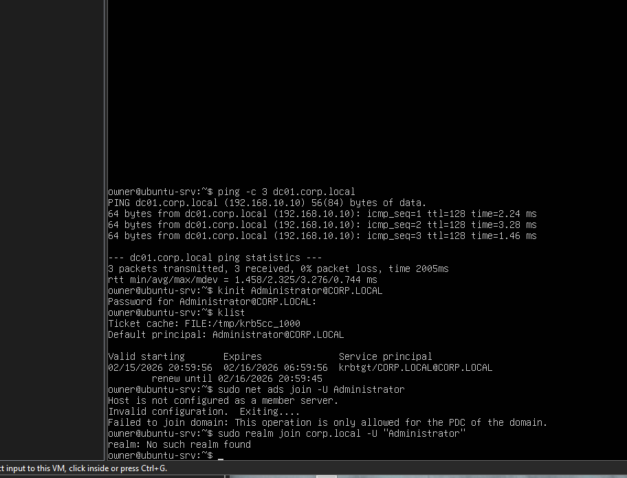
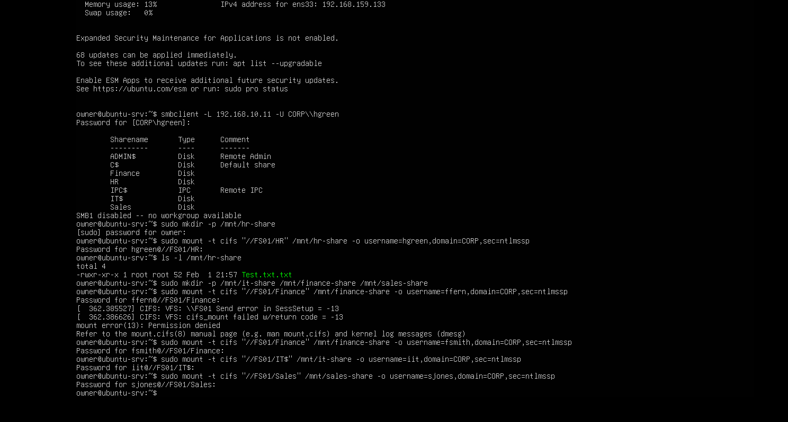
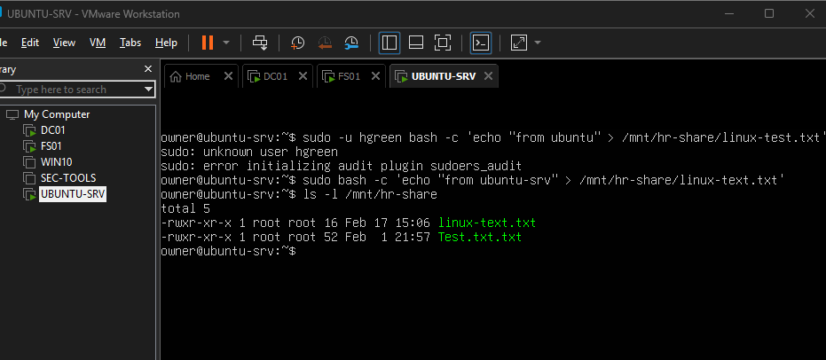
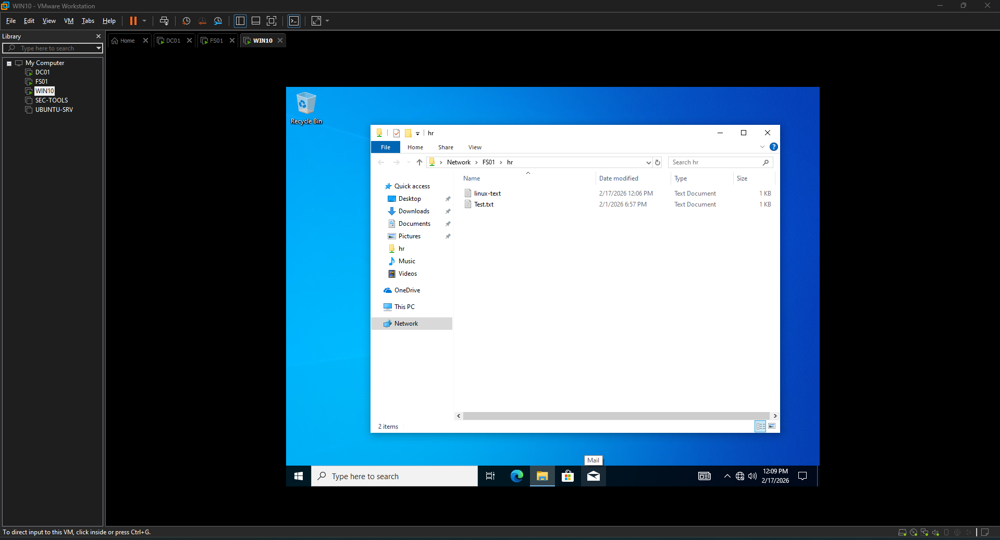
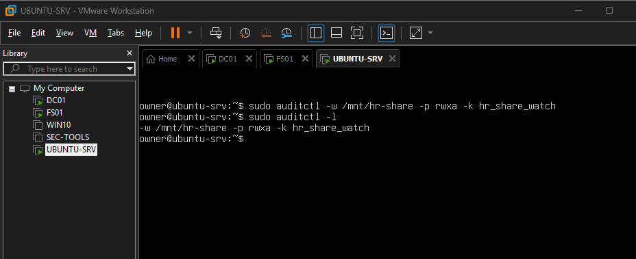
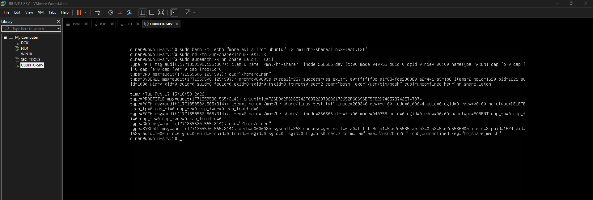
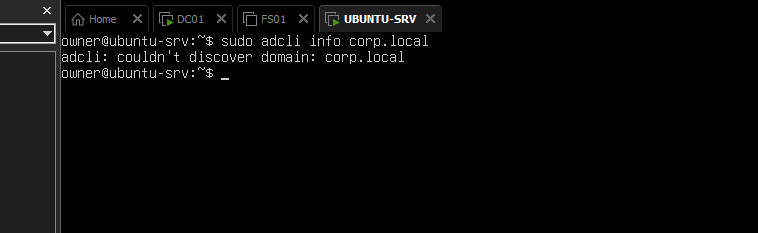

# Phase 4 – Rebuilt Linux Server, File Access, Auditing, and Logging

This phase was completed on a **re‑created** UBUNTU-SRV VM.  
The original Linux server became unstable and could not reliably access the Windows domain or shares, so I built a fresh Ubuntu VM and repeated the integration steps. During this work I:

- Restored SMB access from Ubuntu to FS01 shares.
- Implemented Linux `auditd` rules and Windows 4663 auditing against the same HR files.
- Verified cross‑platform file access (Linux → Windows share).
- Documented partial AD / Kerberos integration issues.

---

## 1. Rebuilt UBUNTU-SRV Overview

1. Created a new Ubuntu VM in VMware Workstation and named it `UBUNTU-SRV`.
2. Installed updates and basic tooling:

   ```bash
   sudo apt update
   sudo apt upgrade -y
   ```
- Verified network connectivity to DC01 and FS01 with ping.

- Issues on the original VM (reason for rebuild):

    -Intermittent name resolution to dc01.corp.local and fs01.

    - Kerberos/domain join tools (realm, adcli) failing even with correct DNS.

    - SMB access to FS01 HR share unreliable and dropping between tests.



## 2. SMB Mounts from UBUNTU-SRV (HR Share Example)
### 2.1 Confirm the HR share is mounted
On UBUNTU-SRV:

```bash
ls -l /mnt/hr-share
```
If the directory is empty or you get an error, mount the share:

```bash
sudo mount -t cifs "//FS01/HR" /mnt/hr-share \
  -o username=CORP\\hgreen,sec=ntlmssp
```
You should now see the HR files from FS01.


## 3. Linux Test File on the HR Share
Create and verify a test file from UBUNTU-SRV:

```bash
sudo bash -c 'echo "created from ubuntu-srv" > /mnt/hr-share/linux-test.txt'
ls -l /mnt/hr-share
```


From a Windows client (HR user session):

Browse to the HR share on FS01 and confirm linux-test.txt is visible.



## 4. Configure Linux Auditing with auditd
Install and enable auditd on UBUNTU-SRV:

```bash
sudo apt install -y auditd audispd-plugins
sudo systemctl enable --now auditd
sudo systemctl status auditd
```
Then add an audit rule for the HR mount:

```bash
sudo auditctl -w /mnt/hr-share -p rwxa -k hr_share_watch
sudo auditctl -l
```
You should see /mnt/hr-share listed with key hr_share_watch.



## 5. Generate and Verify Linux Audit Events
From UBUNTU-SRV, modify and/or delete the test file:

```bash
sudo bash -c 'echo "more edits from ubuntu" >> /mnt/hr-share/linux-test.txt'
sudo rm /mnt/hr-share/linux-test.txt
```
Check for matching audit events:

```bash
sudo ausearch -k hr_share_watch | tail
```
You should see entries referencing /mnt/hr-share and linux-test.txt.




## 6. Windows 4663 Events on FS01 (Terminal Only)
Object access auditing on the HR folder (C:\Dept\HR) was enabled in earlier work.
On FS01, use PowerShell to filter 4663 events for that path:

```powershell
$path = 'C:\Dept\HR'

Get-WinEvent -FilterHashtable @{ LogName = 'Security'; Id = 4663 } |
Where-Object { $_.Message -like "*$path*" } |
Select-Object TimeCreated, Id, Message |
Format-Table -AutoSize
```
Confirm at least one event shows:

Id = 4663.

Object Name: C:\Dept\HR\linux-test.txt (or the file created from Ubuntu).

Account Name for CORP\hgreen.


7. Kerberos / Partial AD Integration Issues
DNS and Kerberos work, but automated Linux realm join is incomplete.

Working pieces (already validated):

```bash
dig @192.168.10.10 corp.local
dig @192.168.10.10 _kerberos._tcp.corp.local SRV
kinit Administrator@CORP.LOCAL
klist
```
Problems appear when using realm/adcli:

```bash
realm discover corp.local
adcli info corp.local
```
These commands fail with messages like “No such realm found: corp.local” or “couldn’t discover domain: corp.local”, even though DNS and Kerberos tests succeed. This is documented as known issue / future work; for this phase, SMB access plus auditing is sufficient.



(You already also referenced can-ping-AD-but-cant-join-realm at the start to show connectivity vs. join failure.)

## 8. Summary / What This Phase Demonstrates
- Rebuilt UBUNTU-SRV and re‑established reliable connectivity to DC01 and FS01.

- Mounted the HR share from Linux, created a test file, and confirmed it from a Windows client.

- Enabled Linux auditd rules for /mnt/hr-share and verified read/write/delete events.

- Confirmed Windows Security 4663 events on FS01 for the same file, tying Linux activity to Windows auditing.

- Tested Kerberos and documented realm/adcli discovery issues for future SSSD‑based domain integration.
