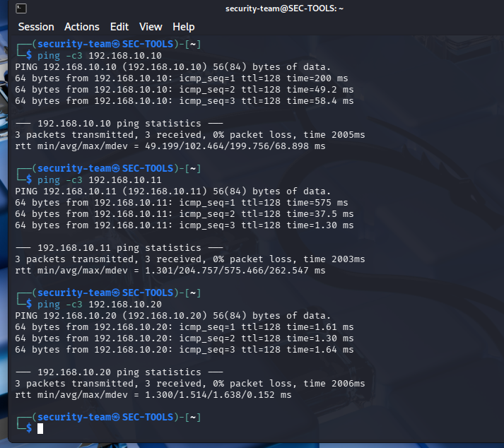
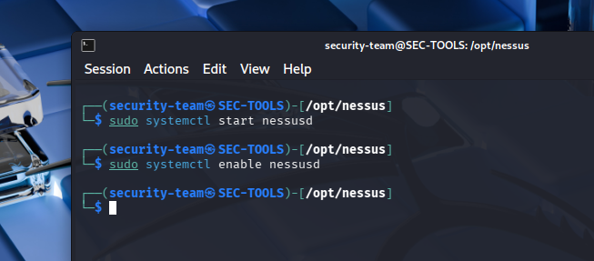
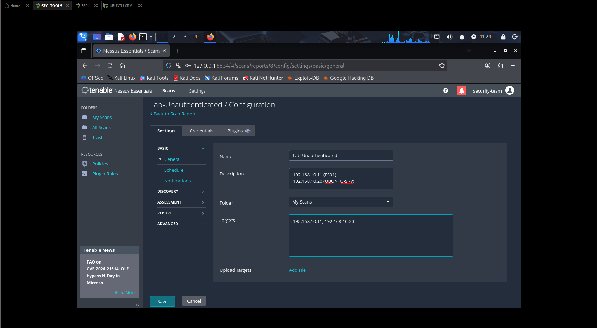
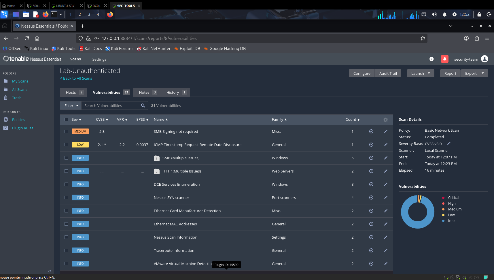
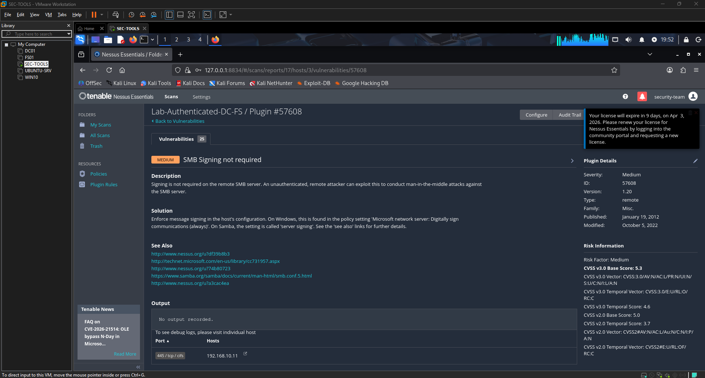
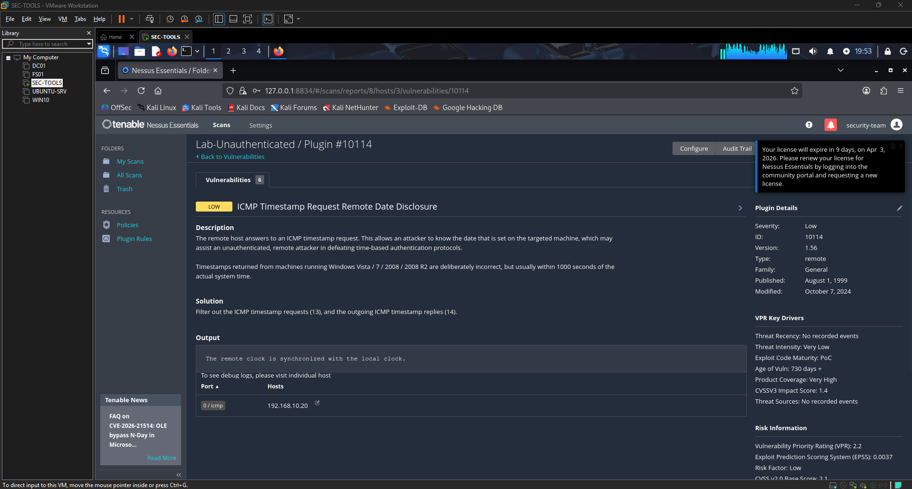
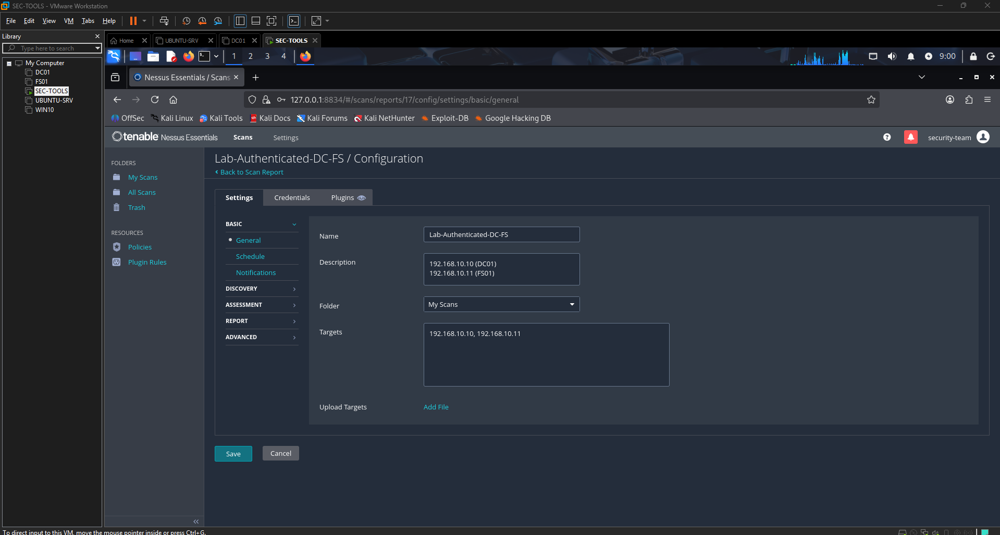
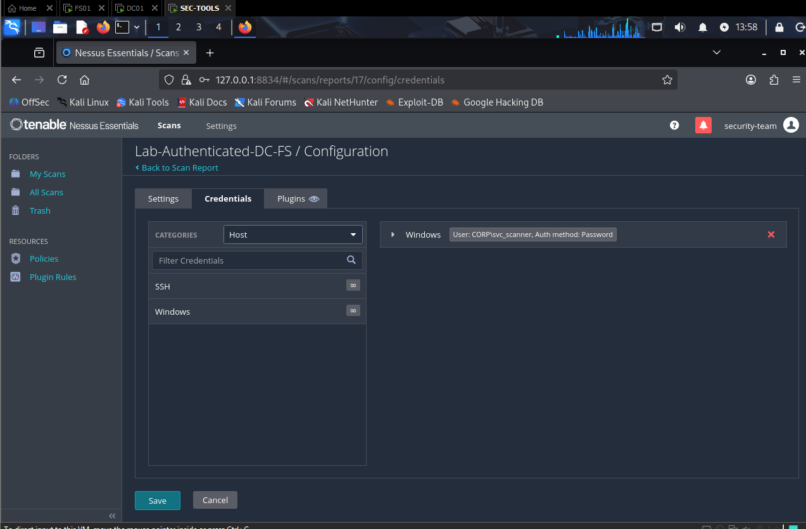
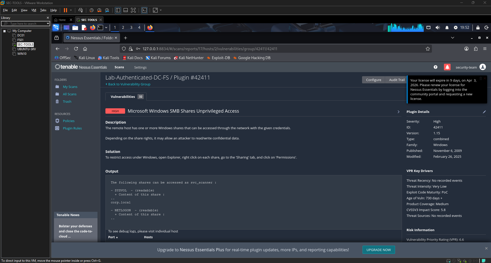

# Phase 6 – Vulnerability Assessment (Nessus + Kali)

This step records my installation of Nessus Essentials into SEC-TOOLS (Kali) VM, unauthenticated and attempted authenticated scans of DC01, FS01, and UBUNTU-SRV, the scan traffic, and necessary findings that have been identified to push forward hardening efforts.

---

## 6.1 Environment and Connectivity

I made sure that SEC-TOOLS could access the three target servers via the lab network, prior to installing Nessus:

```bash
ping -c3 192.168.10.10   # DC01
ping -c3 192.168.10.11   # FS01
ping -c3 192.168.10.20   # UBUNTU-SRV
```


## 6.2 Get Nessus Essentials on Kali.
To install the Nessus Essentials .deb on SEC-TOOLS, I installed the essentials package and then started the service so that the web UI can be reached on https://127.0.0.1:8834:
```
bash
cd /opt/nessus
sudo systemctl start nessusd
sudo systemctl enable nessusd
```


From the SEC-TOOLS browser I went through the first Nessus Essentials setup, created an Essentials key, and left the initial download of the plugins run.

## 6.3 Unauthenticated Scan – FS01 and UBUNTU-SRV
### 6.3.1 Scan configuration
I set up an unauthenticated "Basic Network Scan" to both the windows file server and Ubuntu server:

Name: Lab-Unauthenticated

Targets: 192.168.10.11 (FS01), 192.168.10.20 (UBUNTU-SRV)

No credentials




Having saved the policy I started the scan and waited until it was done.

### 6.3.2 Results and top findings without authentication.
After the scan was complete Nessus advanced a report of basically informational problems as well as a few low/medium findings apparent on the network:




Important unauthenticated results I used subsequently to make remediation:

No required SMB Signing (FS01, Medium)

Type: configuration / weak SMB protection

This was demonstrated by Nessus when it reported that the file server supports signed SMB sessions as thus allowing man in the middle attacks.



ICMP Timestamp request remote date disclosure (UBUNTU-SRV, Low)

Type: information disclosure.

ICMP timestamping UBUNTU-SRV acted on ICMP timestamp messages, providing unauthenticated hosts with information on its system time.



SMB (Multiple Issues) (FS01, Info)

Name: service exposure / protocol inventory.

Supported SMB dialects and capabilities were enumerated and it is on those that I based further SMB hardening (signing, SMBv1 state).

{UBUNTU-SRV, Info) HTTP (Multiple Issues)

Type: information disclosure.

Type and version of revealed HTTP server, that is, basic banner information is available to the network.

Nessus SYN scanner / DCE Services Enumeration / VMware Virtual Machine Detection (FS01, Info).

Type: open service enumeration and port enumeration.

FS01 Confirmed listening services and verified that the server can be used as a scan target.

These unauthenticated findings provided me with a level of what an external attacker can view without authentication.


## 6.4 Attempted Authenticated Scan – DC01 and FS01
### 6.4.1 Scan configuration and credentials
To generate the authenticated test I prepared a different scan targeting to the domain controller and file server:

Name: Lab-Authenticated-DC-FS

Targets: 192.168.10.10 (DC01), 192.168.10.11 (FS01)

Policy: Basic Network Scan

Windows credentials: domain account CORP\svcscanner created in AD and made a member of the local Users group on DC01 and FS01.




I ensured on both servers that svcscanner was in the local Users group and enabled windows firewall rules on both WMI and Remote Administration so Nessus could be allowed to attempt credentialed checks.

### 6.4.2 Auth scan behavior
The verified scan was successful against both hosts but Nessus Essentials returned Auth: Fail, which implied that the scanner was unable to completely gain credentialed checks with svcscanner regardless of the firewall and service modifications.

Screenshot 6‑8 – Authenticated scan results summary showing DC01 and FS01 with vulnerability counts.
auth-results-summary

The scan was still able to make some useful host-based discoveries when it could use SMB access, including:

Microsoft Windows SMB Shares Unprivileged Access (DC01, High) - a share like SYSVOL/NETLOGON and others could be read by svcscanner.

SMB Signing not required (FS01, Medium) - this is identical to unauthenticated, but is now validated in light of a domain user.



(In the lab write-up I recorded the credential configuration process and the Auth: Fail state and used the unauthenticated base together with the following SMB findings to lead to remediation, in effect).

## 6.5 Selected Findings and Planned Mitigations
The remaining part of the lab I spent on three representative vulnerabilities one vulnerability per host:

| Host       | Nessus Finding                                   | Type                    | Planned Control                                                |
| ---------- | ------------------------------------------------ | ----------------------- | -------------------------------------------------------------- |
| UBUNTU-SRV | ICMP Timestamp Request Remote Date Disclosure    | Info disclosure         | Enable ufw, default deny incoming, allow only needed services. |
| FS01       | SMB Signing not required                         | Configuration / SMB     | Enforce SMB signing on the server (GPO/registry).              |
| DC01       | Microsoft Windows SMB Shares Unprivileged Access | Access control / shares | Apply least‑privilege ACLs to lab shares, tighten access.      |

UBUNTU-SRV – ICMP timestamp
On UBUNTU-SRV I set ufw to default-deny incoming and only to SSH:

```bash
sudo ufw default deny incoming
sudo ufw default allow outgoing
sudo ufw allow ssh
sudo ufw enable
sudo ufw status verbose
```
This prevents unsolicited ICMP timestamp requests with minor management access required.

FS01 – SMB signing not required
On FS01 I was going to use the "Microsoft network server: Digitally sign communications (always) policy or similar registry entries and re-scan to ensure the "SMB Signing not required" plugin no longer identifies the server.

DC01 – SMB shares unprivileged access
On DC01 I used the Nessus result (SMB Shares Unprivileged Access) to find the shares that can be read by ordinary users (svcscanner). Later I used least-privilege on the data share of lab data (without breaking SYSVOL/NETLOGON) and re-scanned Nessus to verify that non-admin accounts could no longer see the shares.

## 6.6 Summary
In this phase I:

Installed the SEC-TOOLS Kali VM online in the Nessus Essentials and verified that it was connected to DC01, FS01, and UBUNTU-SRV.

Used an unauthenticated scan of FS01 and UBUNTU-SRV to baseline external-attacker.

Tried to do an authenticated scan of DC01 and FS01 with the svc_scanner domain account, recording the configuration, and the Auth: Fail status in Nessus Essentials.

Three main findings (ICMP timestamp disclosure, SMB signing not required and SMB share over-exposure) were identified to spur motivated hardening measures in the second step.

This will install Phase 7, in which I implement certain controls on each host (ufw rules, SMB signing and share permissions) and confirm that I have made progress with follow-up Nessus scans.
